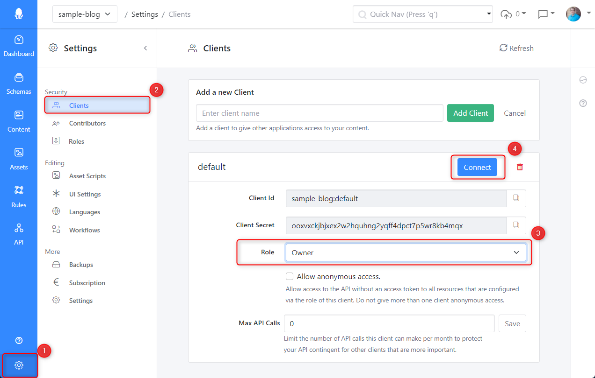

# Squidex Templates

This repository contains app templates for Squidex CMS.

The main repository: https://github.com/squidex/squidex

## How to make feature requests, get help or report bugs? 

Please join our community forum: https://support.squidex.io

## Existing Templates

Just click one of the following links to navigate to the templates and to get installation instructions.

> IMPORTANT: The samples are based on the official CLI, which can be downloaded from the following link:  [Download CLI](https://github.com/Squidex/squidex-samples/releases).

* [Sample Blog](sample-blog/README.md): Create a simple blog with samples for ASP.NET Core, React, Angular and VueJS.
* [Sample Profile](sample-profile/README.md): Create a simple profile page with a sample for ASP.NET Core.

## How to create a new template?

This repository is open for contributions. You can easily create new templates without any coding knowledge:

### 1. Download the CLI

The first step is to download the CLI: https://github.com/Squidex/squidex-samples/releases

This tool provides a lot of useful features to work with Squidex CMS and to automate processes such as export, import and backups. [Documentation](https://docs.squidex.io/02-documentation/developer-guides/automation-tools).

It also provides a powerful `sync` command, which can be used to export all settings, contents and assets to a file system and to import everything to an existing app. This is the command which is used for the samples.

### 2. Create a new App in Squidex

This app will contain everything (and not more) that should be part of your sample.

### 3. Connect the CLI to your App



1. Go to the **Settings** area of your app.
2. Go to the **Clients** settings.
3. Ensure that your client has owner permissions. It actually depends what you want to export, but usually the CLI needs a lot of permissions. Therefore we temporarily give full permissions to the CLI.
4. Click the **Connect** button to follow a wizard that will tell you exactly how to configure the CLI.

### 4. Export your App

Enter the following command to your shell:

```
sq sync out <TARGET_FOLDER> --describe
```

This will export all settings. You can also target a subset of the data and settings. For example use the following command to export only contents and schemas:

```
sq sync out <TARGET_FOLDER> -t contents -t schemas --describe
```

Use the help with `--help` to see all targets.

```
sq sync out --help
```

The `--describe` parameter is used to create a `README.md` file to describe your template.

You can also create a description from an existing export with 

```
sq sync describe <TARGET_FOLDER>
```

### 5. Describe your Sample

Enrich the `README.md` file with a description of your sample.

### 6. Create a pull request

Clone this repository and create a full request. Follow this checklist:

* [ ] I have added a link in the root `README.md` file to my sample.
* [ ] I have tested my sample with a new, empty app.
* [ ] I have added a few lines of description to my sample.
* [ ] I have added links to sample source code, if available.
* [ ] I have updated the `README.md` file to point to the repository location.
